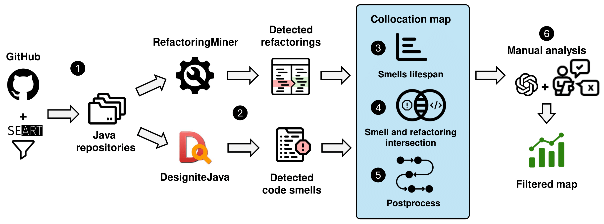

# Code smell evolution and refactoring: Empirical study

Code smells serve as indicators of underlying quality issues that negatively impact software maintainability. Refactoring is a widely recognized technique for improving code quality by restructuring code. This study aims to shed light, to the best of our knowledge for the first time in the literature, on code smells and the types of refactorings that one can apply to address such smells. In this empirical study, we aim to investigate the evolution of code smells and the impact of applied refactoring techniques to offer developers actionable advice to make better decisions about when and how to refactor code. This study examines $87$ open-source Java repositories to investigate the lifespan of code smells, the effectiveness of refactorings in resolving them, and their broader relationship with refactoring practices. Our findings provide a detailed mapping between specific refactoring techniques and various design and implementation smell categories. We combine automated detection with manual analysis to deepen our understanding of the interactions between code smells and refactoring.

**<div style="text-align: center">Approach Overview</div>**



## Computational requirements

### Software Requirements

- Windows/Linux
- Java runtime v17
- Executables:
  - [DesigniteJava v2.5.9](bin/executables/DesigniteJava.jar)
  - [RefactoringMiner v3.0.9](bin/executables/RefactoringMiner-3.0.9/)
- Python 3.11+
  - GitPython
  - pandas
  - numpy
  - scikit-learn
  - openai
  - tiktoken
  - seaborn
  - matplotlib
  - lifelines
  - chardet

### Memory and Runtime Requirements

Any CPU with a **minimum memory of 16GB** with **4 cores** should be sufficient to run the analysis.

## Steps to reproduce

(_Note: Provided steps are for linux based system_)

To use the same repositories as analyzed in the study, the repositories can be downloaded from [Zenodo](https://zenodo.org/records/15285379).

To reproduce from scratch, the following steps are required:

#### Table of Contents

[Steps to reproduce](#steps-to-reproduce)  
 1 [Dependencies and Environment Set-Up](#dependencies-and-environment-set-up)  
 2 [Repository selection](#repository-selection)  
 3 [Data preparation](#data-preparation)  
 4 [Data analysis](#data-analysis)  
 5 [Post-processing](#post-processing)  
 6 [Manual analysis](#manual-analysis)  
 7 [Configuration](#configuration)

---

### Dependencies and Environment Set-Up

- Clone this repository to the local folder '`cd`' into the folder.

- _(optional)_ Setup virtual environment

  ```sh
  python -m venv <venv_name>
  source <venv_name>/bin/activate
  ```

- Install all the dependencies
  ```sh
  pip install -r requirements.txt
  ```

### Repository selection

List of repositories shortlisted for the study can be found in the file `bin/data/corpus_specs.json`. The file contains the following fields:

- `parameters`: The parameters used to filter the repositories.
- `items`: The list of repositories that were selected based on the parameters.

> Note: The repository index of list `items` is used to for further analysis with `<repo_idx>`.

### Data preparation

1. **Code smell detection**:

```
python3 scripts/data_generation.py designite <repo_idx>
```

2. **Refactoring identification**:

```
python3 scripts/data_generation.py refminer <repo_idx>
```

### Data analysis

After the data generation, the following steps are performed:

1. **Individual repository analysis**:

```
python3 scripts/analysis.py <repo_idx>
```

2. **Aggregate analysis (Corpus level)**:

```
python3 scripts/analysis.py
```

This will generate the smells and refactorings collocation mapping for the entire corpus.

### Post-processing

```
python3 scripts/postprocess.py
```

### Manual analysis

To conduct the manual analysis, utilize respective modules in `scripts/manual_analysis.py` and `scripts/llm_analysis.py` as required.

#### Configuration

Make changes to the `scripts/config.py` file to change the configuration of the analysis if needed.

---

### License

[Apache-2.0](https://anonymous.4open.science/r/code_smell_evolution/LICENSE)
